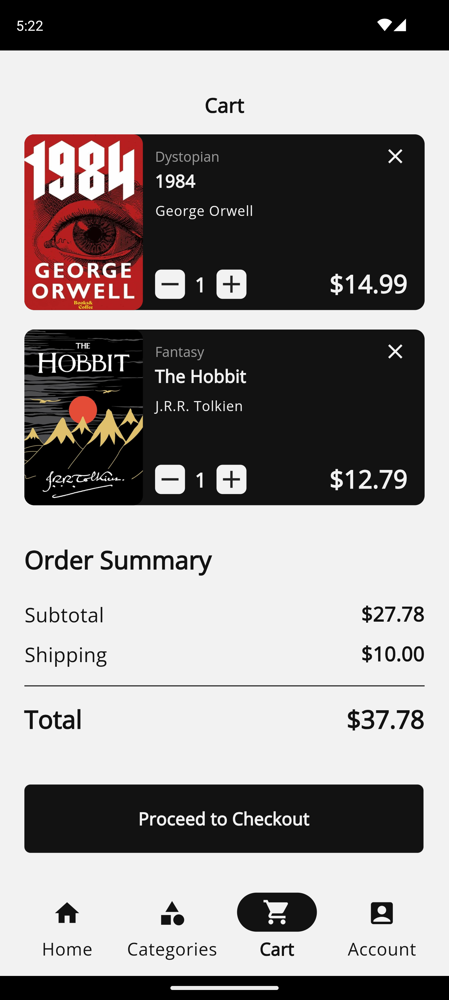

# Bookstore App 📚


A user-friendly app for discovering and exploring books.

---

## Design Inspiration 🎨

Design Inspiration: [View Design Inspiration](https://www.figma.com/community/file/1187676718154727707/bookstore-app)

---

## Download the App 📥

Download the APK for Android: [Download APK](https://drive.google.com/file/d/1_tySIBjZ96JBGwJNwuLJJms9KgfA0g9s/view?usp=drivesdk)

---

## Screenshots

| Start Screen             | Login Screen             | Registration Screen      |
|:------------------------:|:------------------------:|:------------------------:|
|  |  |  |

| Home Screen              | Book Detail Screen       | Category Screen          |
|:------------------------:|:------------------------:|:------------------------:|
|  |  |  |

| Cart Screen              | Profile Screen           |
|:------------------------:|:------------------------:|
|  |  |                        |


---

## Installation

Follow these steps to set up the app:

1. **Clone the repository**
    ```bash
    git clone https://github.com/Dilman01/bookstore_app.git

    cd bookstore_app
    ```
2. **Install dependencies**
   ```bash
    flutter pub get
   ```
3. **Create a Firebase project**
    * Go to [Firebase](https://firebase.google.com/), and create a new project.
    * Go to Authentication > Sign-in method, and make sure to enable  the Email/Password sign-in provider.
    * Then Integrate it with the app using the following command:
      ```bash
         flutterfire configure
      ```
4. **Generate necessary files**
   * Use the build_runner tool to generate required files:
   ```bash
    dart run build_runner build -d 
   ```
5. **Run the app**
   ```bash
    flutter run
   ```
---

## Contact
For questions or feedback, please contact dilmandev@gmail.com.